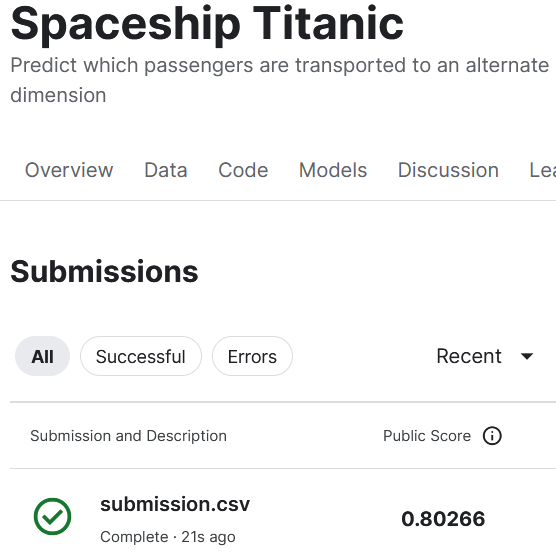

# Spaceship_Titanic_EDA
데이터 사이언스, 머신러닝을 학습하기 위한 저장소 입니다.

## 개요
2912년 13,000명의 승객이 탑승한 우주선은 '55 Cancri E'로 항해하던 중 'Alpha Centauri'를 공전하다 먼지구름 속에 숨겨진 시공간 이상 현상과 충돌했습니다. 우주선은 손상되지 않았지만, 승객의 절반이 다른 차원으로 이동해버렸습니다. 실종된 승객을 찾기 위해 우주선의 손상된 컴퓨터 시스템에서 복구된 기록을 사용하여 어떤 승객이 실종되었는지 예측해야 합니다.

## 목표
* 손상된 데이터에서 어떤 승객이 다른 차원으로 이동했는지 예측해야합니다.

## 파일 및 데이터 필드 설명
* **train.csv** : 승객의 약 2/3(~8,700명)에 대한 기록 파일

* **PassengerId** : 승객의 고유ID, gggg_pp 형식이며 gggg는 그룹, pp는 그룹 내 번호이고 그룹에 속한 사람들은 가족인 경우가 많지만, 항상 그런 것은 아닙니다.

* **HomePlanet** : 승객이 출발한 행성, 일반적으로 영주권을 가진 승객

* **CryoSleep** : 승객이 동면을 선택했는지 여부를 나타냅니다. 동면 중인 승객은 객실에 갇혀 있습니다.

* **Cabin** : 승객이 머무르는 객실 번호, Deck/num/side형식으로 기록되어 있고 side는 P(Port), S(Starboard)중 하나

* **Destination** : 승객이 내릴 행성

* **Age** : 승객의 나이

* **VIP** : 승객이 항해 중 VIP 서비스 비용을 지불했는지 여부

* **RoomService, FoodCourt, ShoppingMall, Spa, VRDeck** : 우주선 Titanic호의 다양한 편의 시설에 대해 승객이 지불한 금액

* **Transported** : 목적지에 도착했는지 여부, 각 승객에 대해 True, False를 예측해야 합니다.

* **test.csv** : 나머지 승객 1/3(~4,300명)에 대한 기록이며, 이 파일의 Transported 값을 예측하는 것이 이번 분석의 목표입니다.

## 결과
